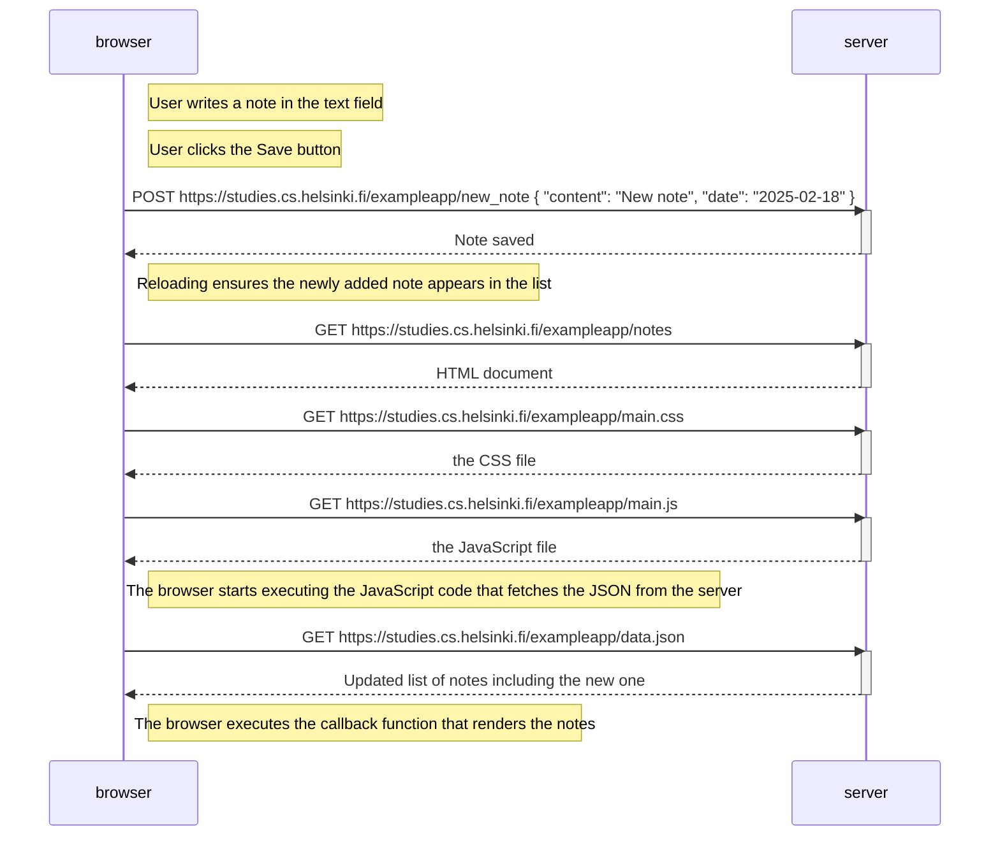

```mermaid
sequenceDiagram
    participant browser
    participant server

    Note right of browser: User writes a note in the text field
    Note right of browser: User clicks the Save button

    browser->>server: POST https://studies.cs.helsinki.fi/exampleapp/new_note { "content": "New note", "date": "2025-02-18" }
    activate server
    server-->>browser: Note saved
    deactivate server

    Note right of browser: Reloading ensures the newly added note appears in the list

    browser->>server: GET https://studies.cs.helsinki.fi/exampleapp/notes
    activate server
    server-->>browser: HTML document
    deactivate server

    browser->>server: GET https://studies.cs.helsinki.fi/exampleapp/main.css
    activate server
    server-->>browser: the CSS file
    deactivate server

    browser->>server: GET https://studies.cs.helsinki.fi/exampleapp/main.js
    activate server
    server-->>browser: the JavaScript file
    deactivate server

    Note right of browser: The browser starts executing the JavaScript code that fetches the JSON from the server

    browser->>server: GET https://studies.cs.helsinki.fi/exampleapp/data.json
    activate server
    server-->>browser: Updated list of notes including the new one
    deactivate server

    Note right of browser: The browser executes the callback function that renders the notes
```
