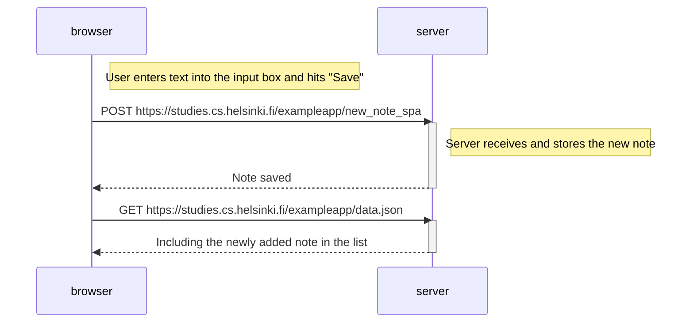

```mermaid
sequenceDiagram
    participant browser
    participant server

    Note right of browser: User enters text into the input box and hits "Save"

    browser->>server: POST https://studies.cs.helsinki.fi/exampleapp/new_note_spa
    activate server
    Note right of server: Server receives and stores the new note
    server-->>browser: Note saved
    deactivate server

    browser->>server: GET https://studies.cs.helsinki.fi/exampleapp/data.json
    activate server
    server-->>browser: Including the newly added note in the list
    deactivate server

```
